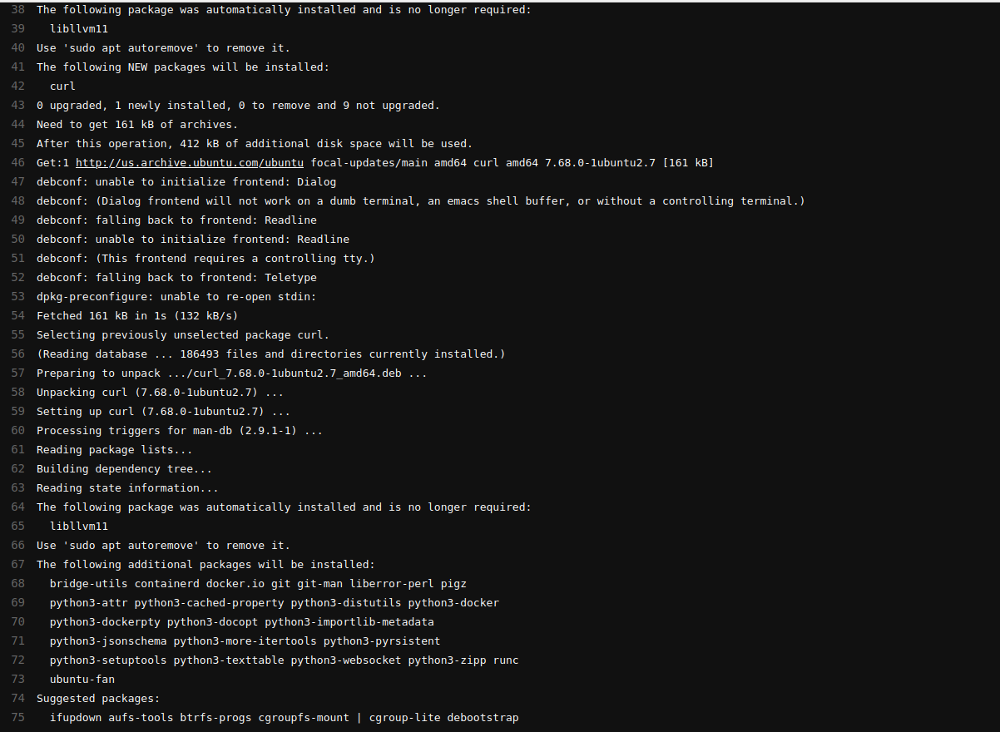
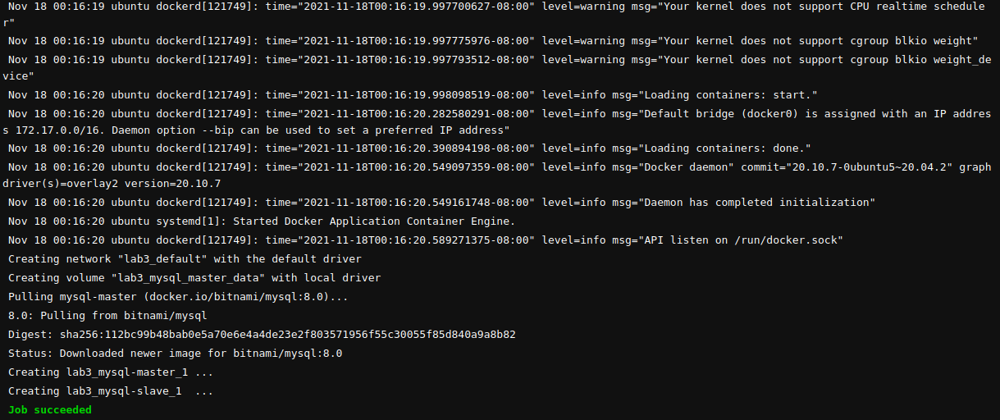
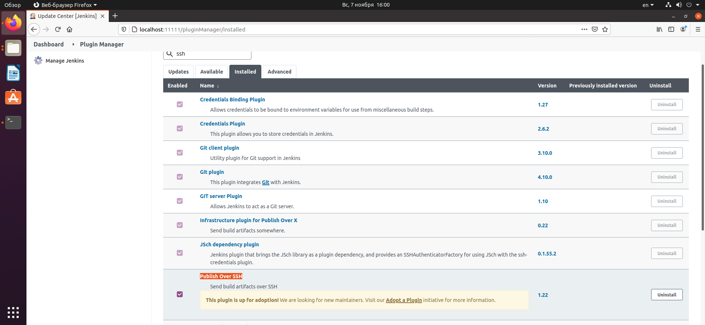
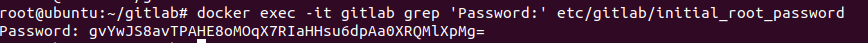

## Jenkins

0) Развернули на второй машине nginx:

1) Запулил образ jenkins в систему:

2) Запуск докер-контейнера:

3) Делаю листинг для проверки и достаю пароль:

4) Вошли и делаем установку:

5) Welcome to Jenkins!:

6) Создаем freestyle project:

7) Создал репозиторий на GitHub, откуда будем тянуть изменения:

8) Сделал базовые изменения в index.html:

9) Ставим плагин для SSH:

10) Настраиваем SSH и проверяем соединение:

11) Собираем проект:

12) Страница nginx:

13) Вносим изменения в репозитории и пушим:

14) Изменения задеплоились минуту спустя:

----

## Gitlab

1) Написал docker-compose.yml с gitlab и gitlab-runner для ci\cd:

2) Поднимаем docker-compose:

3) Листинг контейнеров:

4) Достаем пароль рута для входа на GitLab:

5) Вошли:

5) Регистрируем gitlab-runner:

6) Создаем проект и пишем в нем .gitlab-ci.yml:

7) Создаем переменную $SSH_PASS со значением 1:

8) Собралось и задеплоилось: 

9) Страница nginx после деплоя:

