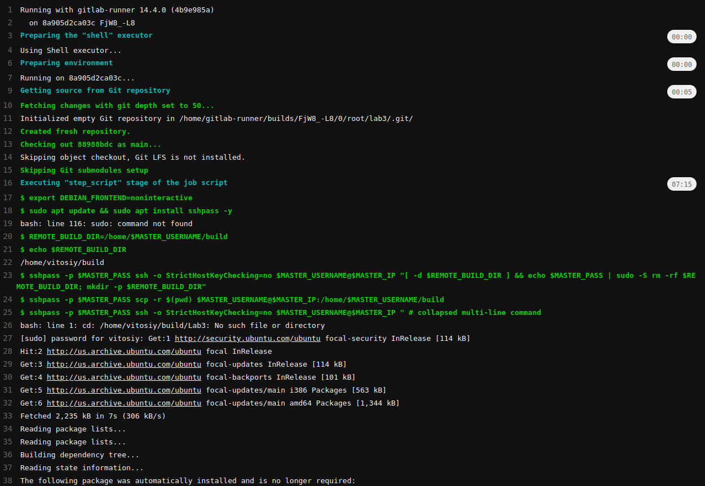
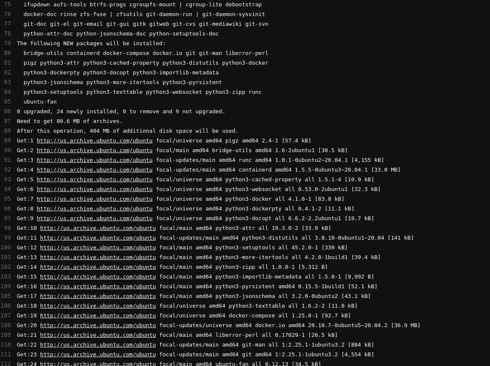
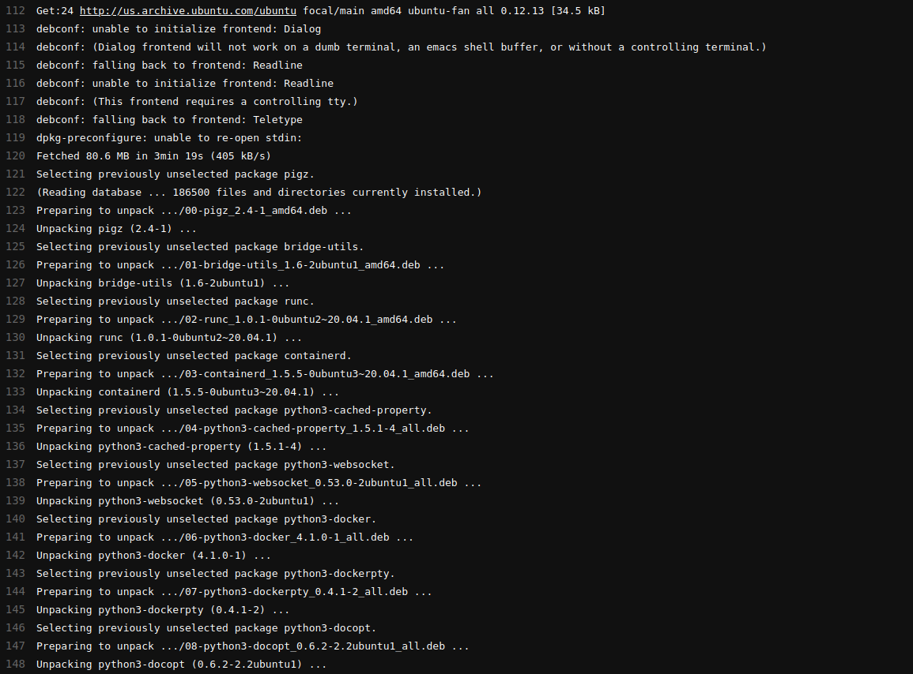
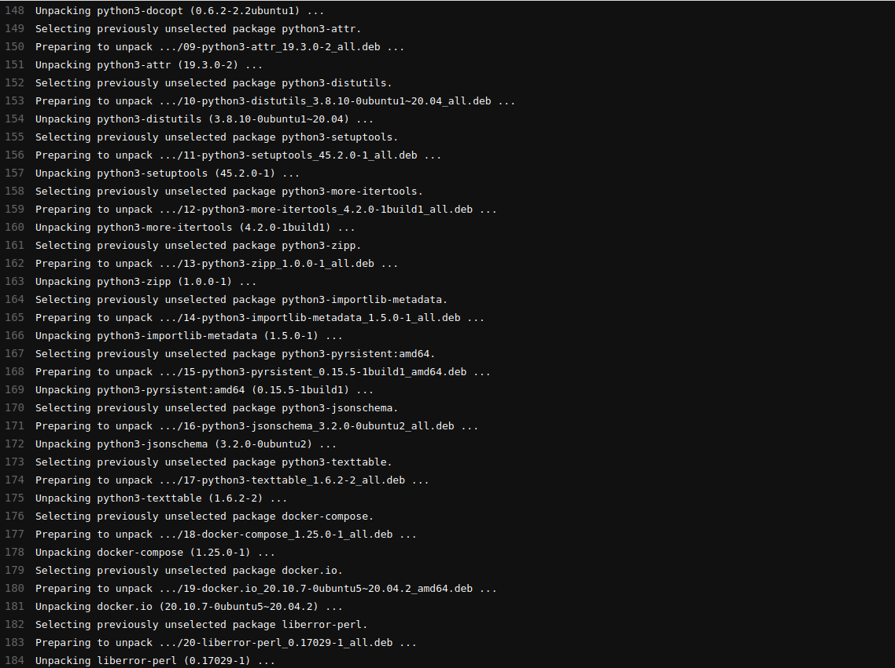

## mysql replication

1) Поднимаем gitlab + runner из прошлой лабы:

[docker-compose.yml](docker-compose.yml)

2) Регистрируем runner как в прошлой лабе, executor - shell

3) Создаем проект для репликации, в CI пишем наш скрипт:

[.gitlab-ci.yml](.gitlab-ci.yml)

4) Сам docker-compose для mysql:

[docker-compose-mysql.yml](docker-compose-mysql.yml)

Кладём его в проект на Gitlab

5) Запускаем pipeline

